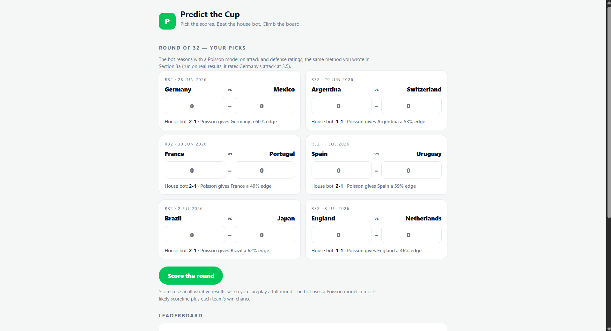
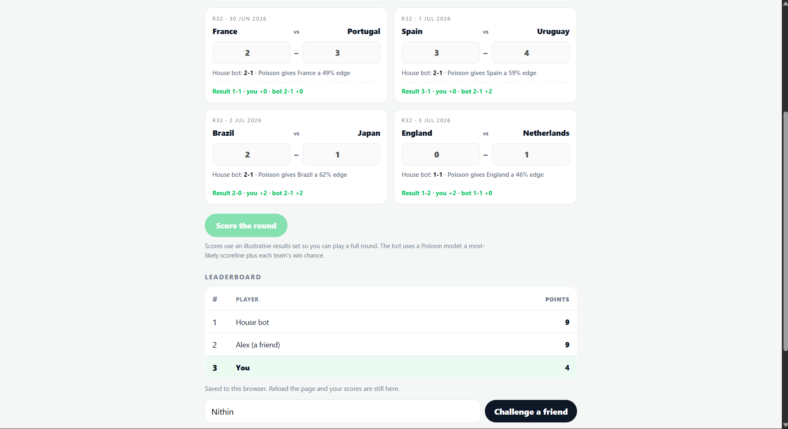
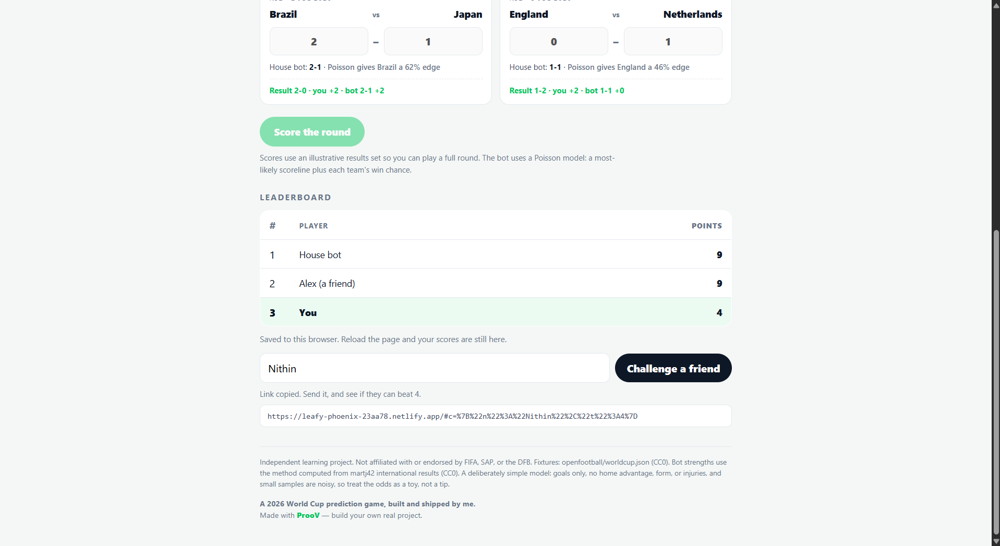

# ⚽ Predict the Cup

A browser-based FIFA World Cup prediction game built with vanilla JavaScript.

Players predict match scores for the Round of 32, compete against an automated house bot, and earn points based on prediction accuracy. The application includes score calculation, opponent prediction logic, persistent leaderboard storage, and a fully deployable single-page implementation.

---

## Live Demo

**GitHub Pages**

https://github.com/nithingoud78/predict-the-cup.git

or

**Netlify**

https://leafy-phoenix-23aa78.netlify.app/

---

## Screenshots

| Home | Gameplay | Leaderboard |
|------|-----------|-------------|
|  |  |  |

---

# Project Overview

This project was developed as part of the **Frontend Engineering with Prediction Game** project on **ProooV by ProjectStudy**.

The objective was not only to build a working application but also to understand how modern frontend applications are structured by implementing each feature step by step.

Instead of relying on frameworks, the application was intentionally built using plain HTML, CSS, and JavaScript to strengthen core frontend fundamentals.

---

# Why I Built This

I built this project to strengthen my understanding of core frontend development concepts before moving on to larger projects.

The project focuses on implementing application logic manually rather than depending on external libraries or frameworks.

It also helped me understand how multiple independent features combine into a complete browser application.

---

# Learning Objectives

Throughout this project I learned how to:

- Build interactive browser applications using Vanilla JavaScript
- Manipulate the DOM dynamically
- Organize application logic into reusable functions
- Work with JavaScript objects and arrays
- Process prediction data
- Calculate scores programmatically
- Build a simple prediction engine
- Implement leaderboard ranking
- Persist application state using Local Storage
- Deploy static web applications
- Debug JavaScript applications
- Structure frontend projects

---

# Features

- Match prediction interface
- Dynamic fixture rendering
- Score calculation engine
- House Bot prediction logic
- Leaderboard ranking
- Local Storage persistence
- Fully responsive browser interface
- Single-file deployment

---

# Technologies Used

- HTML5
- CSS3
- JavaScript (ES6)
- Local Storage API

---

# Core Concepts Practiced

- Functions
- Arrays
- Objects
- Loops
- Event Handling
- DOM Manipulation
- JSON
- Local Storage
- Sorting Algorithms
- Browser APIs

---

# What I Implemented

This project includes:

- Fixture rendering
- Prediction inputs
- Match scoring system
- House Bot logic
- Leaderboard generation
- Persistent storage
- Complete browser deployment

---

# Deployment

The application can be deployed as a static website using:

- GitHub Pages
- Netlify

No backend or database is required.

---

# Repository Structure

```
predict-the-cup/
│
├── index.html
├── README.md
├── LICENSE
├── assets/
│   ├── screenshot-home.png
│   ├── screenshot-game.png
│   └── screenshot-leaderboard.png
```

---

# Skills Demonstrated

- Frontend Development
- Problem Solving
- JavaScript Programming
- UI Rendering
- Browser Storage
- Application Logic
- Static Deployment

---

# Acknowledgements

This project was completed as part of the **Frontend Engineering with Prediction Game** learning experience provided by **ProooV (ProjectStudy)**.

The project implementation was completed independently by following the educational lab while writing and understanding the required JavaScript logic.

---

**Built and maintained by K Nithin Kumar Goud**

[](https://github.com/nithingoud78)
[](https://linkedin.com/in/nithin-goud78)
[](https://yourwebsite.com)
[](mailto:k.nithingoud78@gmail.com)

---

# License

Distributed under the **MIT License**. See [`LICENSE`](./LICENSE) for more information.